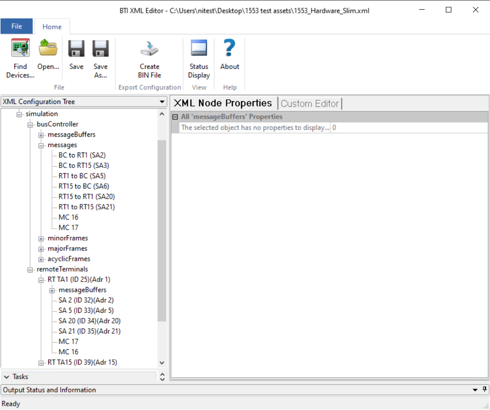
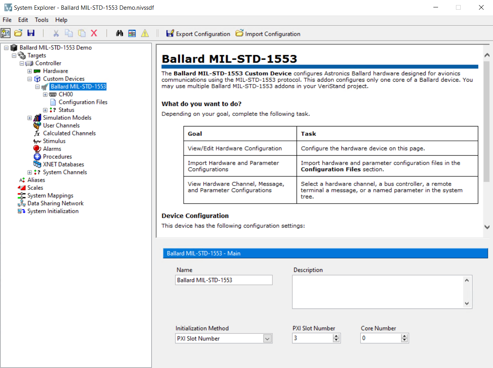
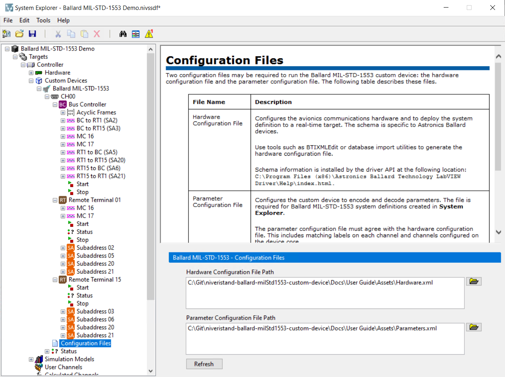
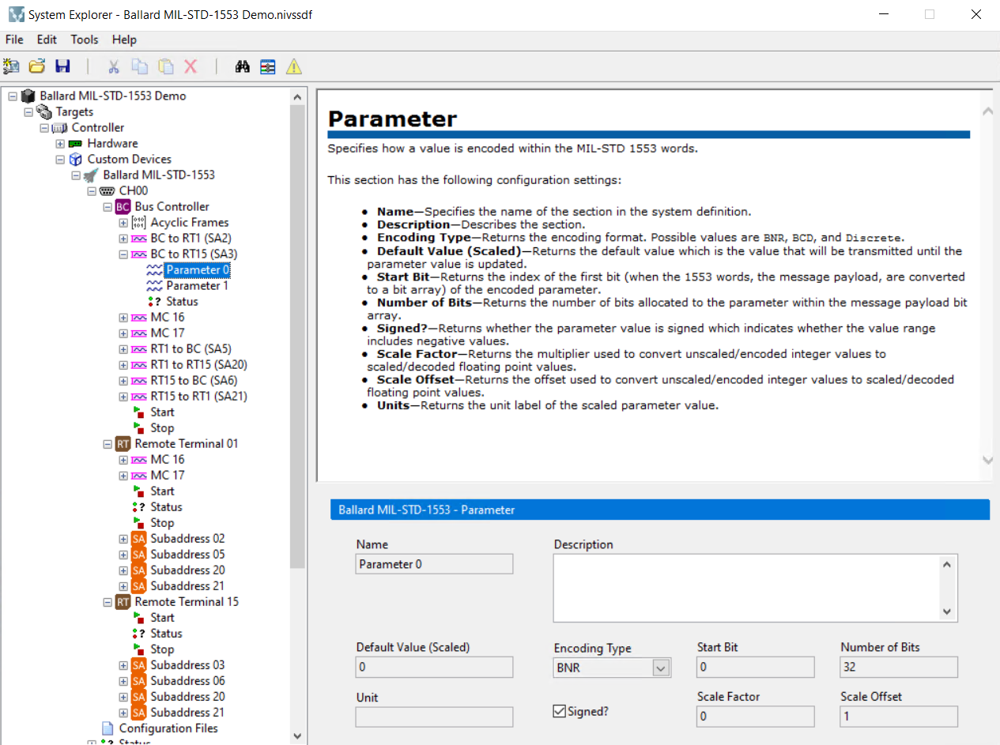
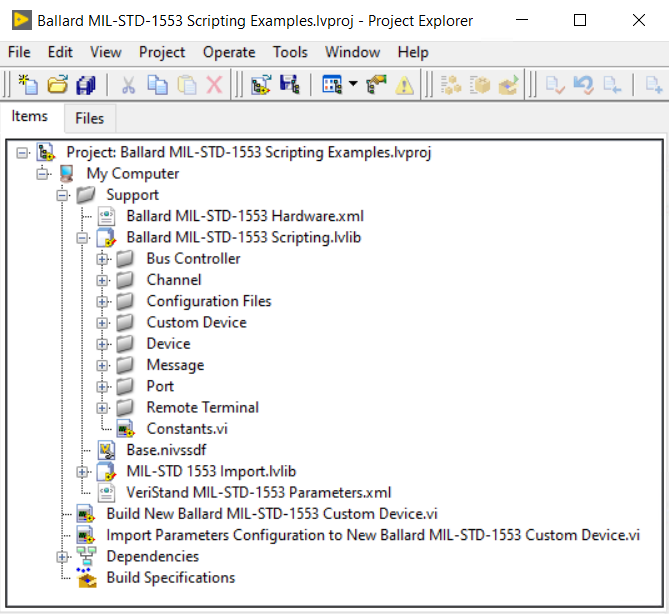
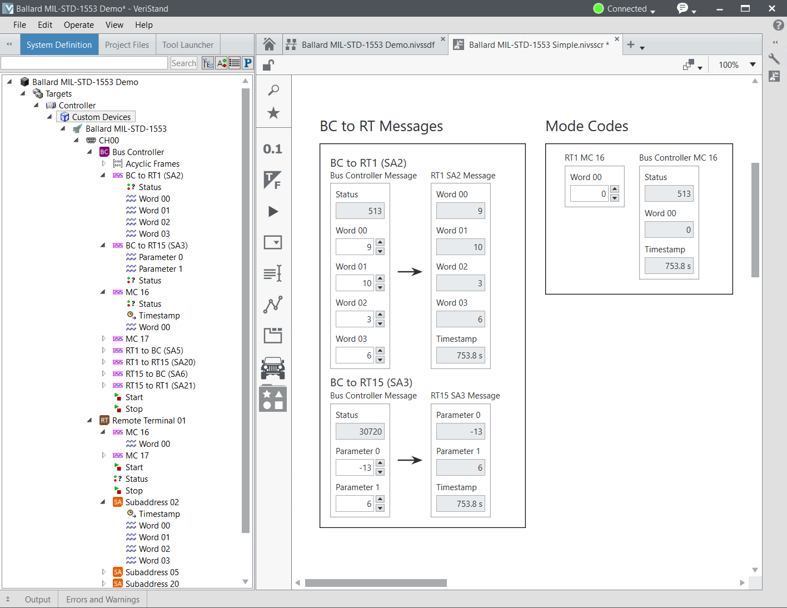
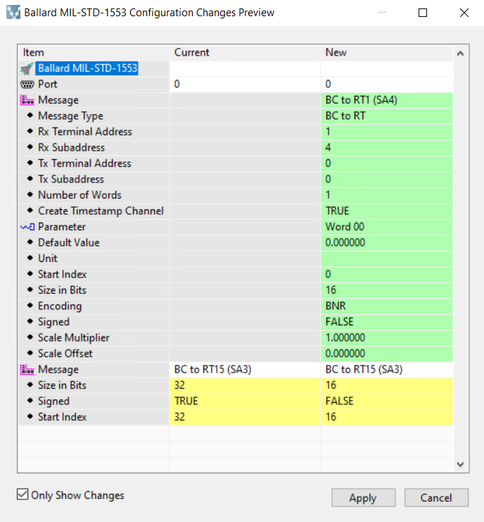

# Using the Ballard MIL-STD-1553 Custom Device

This guide demonstrates how to configure and deploy the Ballard MIL-STD-1553 custom device. Using the receive/transmit channels on the first pin pair of the Ballard MIL-STD-1553 PXI module, it is possible to use the custom device to send and receive data without external wiring.

## Configure the Ballard MIL-STD-1553 Hardware

The custom device targets one **core** of a Ballard MIL-STD-1553 PXI module. To target multiple modules or multiple cores on the same module, you must use multiple instances of the custom device.

A valid hardware configuration for the core must be provided to each instance of the custom device. The hardware configuration is provided by an XML file that adheres to Ballard's schema, referred to here as the `Hardware XML` file. Ballard's driver includes the `BTI XML Editor` application to generate valid hardware configurations.



A simple Hardware XML file is included for getting started with the custom device.

## Configure the Custom Device

This guide shows two options for configuring the custom device:
- Importing a Parameters file in System Explorer
- Scripting the custom device configuration

### Importing a Parameters file in System Explorer
The Parameters file is generated from an XML schema for configuring the custom device. It must match the Hardware XML file's configuration for the Ballard hardware. More information about the Parameters file XML schema can be found in `Docs/Parameters XML File/Parameters XML File.md`.

This example uses simple example Parameters and Hardware files found in the `Assets` directory:
- `Assets/Parameters.xml`
- `Assets/Hardware.xml`

The files are configured with three simulated terminals:
- **0**: Bus Controller
- **1**: Remote Terminal 1
- **2**: Remote Terminal 2

These terminals send and receive messages of each type supported by the Custom Device:
- **BC to RT** - Bus Controller to Remote Terminal.
- **RT to BC** - Remote Terminal to Bus Controller.
- **RT to RT** - Remote Terminal to Remote Terminal.
- **MC** - Mode Code.

Each pair of messages (BC to RT, RT to BC, and RT to RT) are configured with similar settings. One does not define parameters under the message, which will result in VeriStand channels for as many U16 datatype words as are found in the `<numberOfWords>` tag. The second message defines two unscaled 32-bit parameters with BNR encoding, one signed and the other unsigned. Below is the configuration of the two BC to RT messages:

```
		<message>
			<name>BC to RT1 (SA2)</name>
			<address>
				<terminalAddress>1</terminalAddress>
				<subAddress>2</subAddress>
				<direction>Rx</direction>
			</address>
			<messageType>BC to RT</messageType>
			<numberOfWords>4</numberOfWords>
			<createTimestampChannel>true</createTimestampChannel>
		</message>
		<message>
			<name>BC to RT15 (SA3)</name>
			<address>
				<terminalAddress>15</terminalAddress>
				<subAddress>3</subAddress>
				<direction>Rx</direction>
			</address>
			<messageType>BC to RT</messageType>
			<numberOfWords>4</numberOfWords>
			<createTimestampChannel>true</createTimestampChannel>
			<parameters>
				<parameter>
					<encoding>BNR</encoding>
					<signed>true</signed>
					<startBit>0</startBit>
					<numberOfBits>32</numberOfBits>
					<scale>1</scale>
					<offset>0.0</offset>
					<name>Parameter 0</name>
					<defaultValue>0</defaultValue>
				</parameter>
				<parameter>
					<encoding>BNR</encoding>
					<signed>false</signed>
					<startBit>32</startBit>
					<numberOfBits>32</numberOfBits>
					<scale>1</scale>
					<offset>0.0</offset>
					<name>Parameter 1</name>
					<defaultValue>0</defaultValue>
				</parameter>
			</parameters>
		</message>
```

For each message in the Parameters configuration file, the Custom Device creates corresponding VeriStand channels under the simulated terminals contained in the file. For these two example messages, the Bus Controller has the Tx channels, so the words and parameters under the Bus Controller are outputs. The same channels are created under the Remote Terminal 1 and 15, but these are inputs. The resulting System Definition tree and screen contents can be seen in later sections of this guide.

#### Configure the Custom Device in System Explorer

1. Create a new VeriStand Project and configure your PXI Linux RT target.
2. Navigate to the `Targets\Controller\Hardware\Custom Devices` entry in the tree.
3. Right-click the **Custom Devices** entry and add a new instance of the **NI\Ballard MIL-STD-1553** custom device.
4. Use the Main Page to set the **PXI Slot Number** and **Core Number** accordingly.

5. Navigate to the **Configuration Files** page.
6. Use the browse button next to each box to select the example files used for this example.
   1. Hardware file: `niveristand-ballard-milStd1553-custom-device\Docs\User Guide\Assets\Hardware.xml`
   2. Parameters file: `niveristand-ballard-milStd1553-custom-device\Docs\User Guide\Assets\Parameters.xml`


Note: After configuring the custom device, all of the configuration under `Channel` is read-only except for the `Description` field on each page.



#### Scripting the Custom Device Configuration

The Ballard MIL-STD-1553 custom device includes a LabVIEW scripting API to configure the custom device programmatically. This allows users to parse an existing MIL-STD-1553 database into a working custom device configuration without the need to create a Parameters file. It also allows importing a Parameters file programmatically instead of through System Explorer.

To use the scripting API, the optional scripting package must be installed:
`ni-ballard-mil-std-1553-veristand-20xx-labview-support`

The scripting API includes two example files inside a LabVIEW example project found at the following directory: `C:\Program Files (x86)\National Instruments\LabVIEW 20xx\examples\NI VeriStand Custom Devices\Ballard MIL-STD-1553\Support`. It contains two example VIs:

- `Import Parameters Configuration to New Ballard MIL-STD-1553 Custom Device.vi` - Demonstrates using the Ballard MIL-STD-1553 scripting API to configure the custom device by importing a parameters configuration file.
- `Build New Ballard MIL-STD-1553 Custom Device.vi` - Demonstrates using the Ballard MIL-STD-1553 scripting API to configure the custom device by building from configuration clusters.



### Deploy the System Definition

After configuring the System Definition with the custom device, deploy the System Definition using VeriStand. Once the deployment state reaches **Connected**, use a VeriStand screen to display the custom device inputs and outputs. This example uses VeriStand 2020 R5, so your screen controls may behave differently depending on version.

1. Open a VeriStand Screen
2. Highlight the **System Definition** tree in the left rail
3. Expand the tree to `Targets\Controller\Hardware\Custom Devices\Ballard MIL-STD-1553\CH00`
4. Drag the **Bus Controller\BC to RT1 (SA2)** item onto the screen
5. Drag the **Remote Terminal 01\Subaddress 02** item onto the screen
6. Change the values written to the words in the outgoing message (**Bus Controller\BC to RT1 (SA2)\Word 0x**) and see the values received by the Remote Terminal



This example set of Hardware and Parameters files contains other message types, as well as Acyclic Frames. The minor frame that sends the RT to RT messages is tied to the frame trigger in the system definition. To send the RT to RT messages, toggle the **Bus Controller\Acyclic Frames\Trigger (acyclicFrame ID24)** value to non-zero.

### Modifying the Custom Device Configuration

Once the custom device is configured, you can change the configuration using the **Configuration Files** page in System Explorer. If the Parameters file changes on disk, use the **Refresh** button. If you need to select a new file, press the button to load a new path into the dialog.

Each time the configuration is changed, the **Ballard MIL-STD-1553 Refresh** dialog will be displayed to compare the current and new configurations. Press **Apply** to accept the changes, or **Cancel** to exit without reconfiguring.

